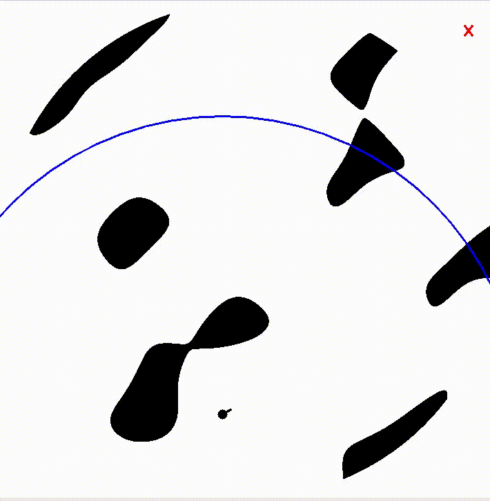

# SLAM-devTools

## Description
Development tools and utilities for SLAM, including an environment to test your own algorithms, as well as readily usable algorithms for SLAM, path planning and motion planning.

## Usage
TBA

## Requirements
- Simpy (v4.0.0)
- TBA

## To contribute
TBA
